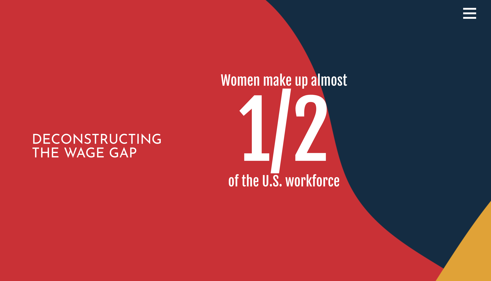
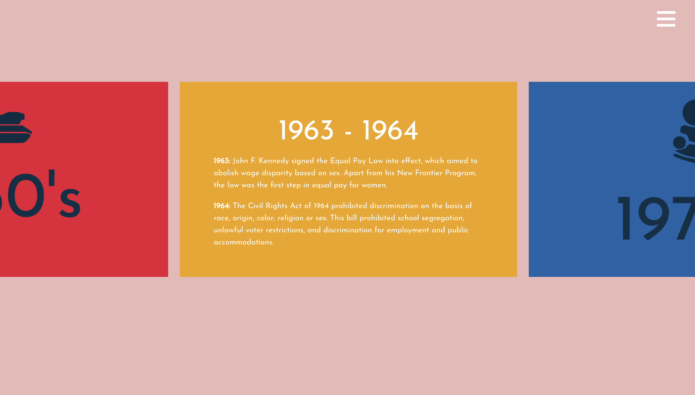

# equal-work-equal-pay
Equal pay Equal work is a data visualization project built as a part of SCCA Spring Quarter. Built with my partner, we illuminated the pay disparity between men and women.

**Screenshots**

**Live link:**
<a href="https://aheitzen.github.io/equal-work-equal-pay/" target="blank">Equal Pay Equal Work</a>

**Technologies used**
* HTML5
* CSS 3
* animate.css
* thimble.css
* PhotoShop
* Illustrator
* jQuery
* mousewheel.js
* d3.js
* wow.js
* moment.js
* particles.js
* ProgressBar.js
* Chart.js
* datamapall.js

**Approach taken**
* Researched the gender pay gap, and organized and defined sections
* Made a quick mock up in AI
* Started coding the html and css, core framework
* Iported jQuery libraries and made sure no conflicts 
* Continued to code each section
* Added final touches and deploy

**Unsolved problems** 
* Not responsive 

